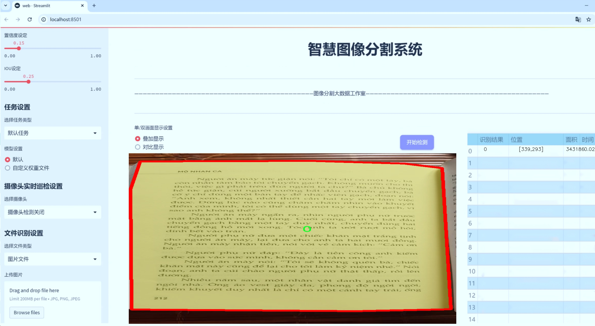
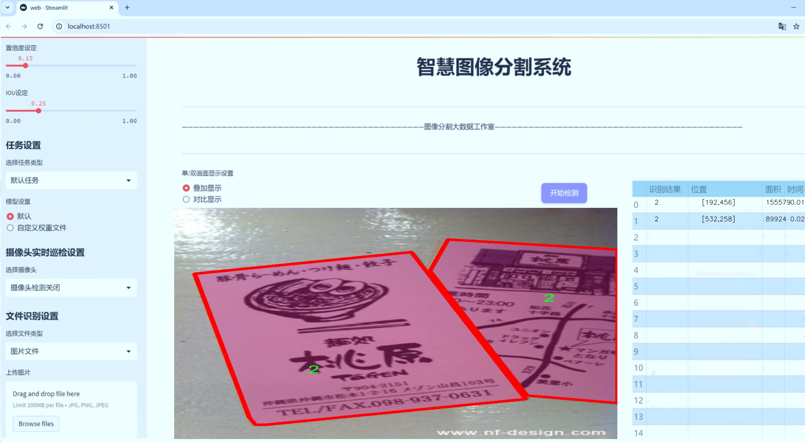
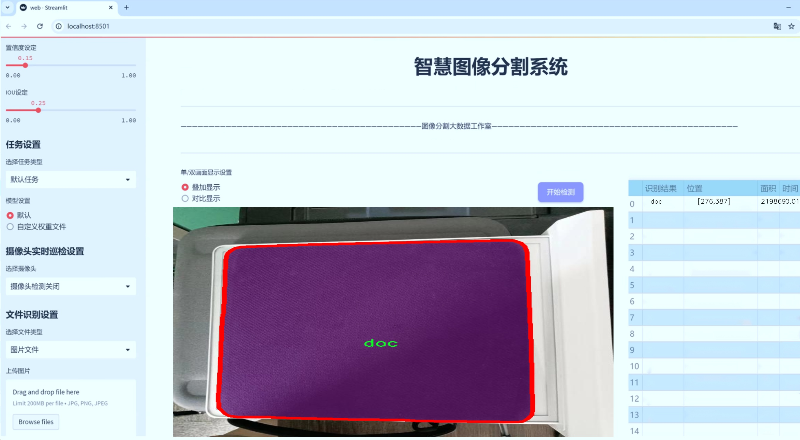
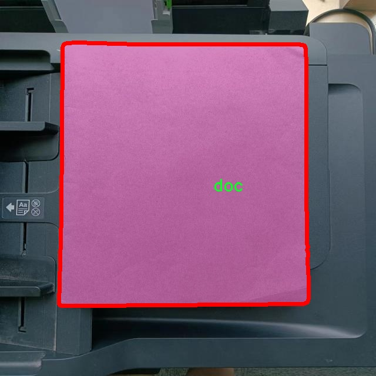
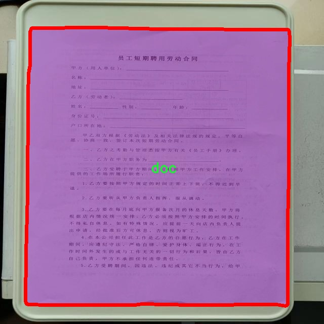
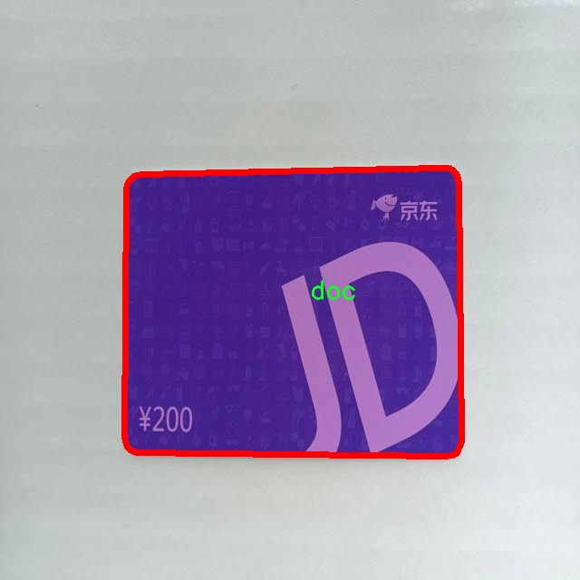
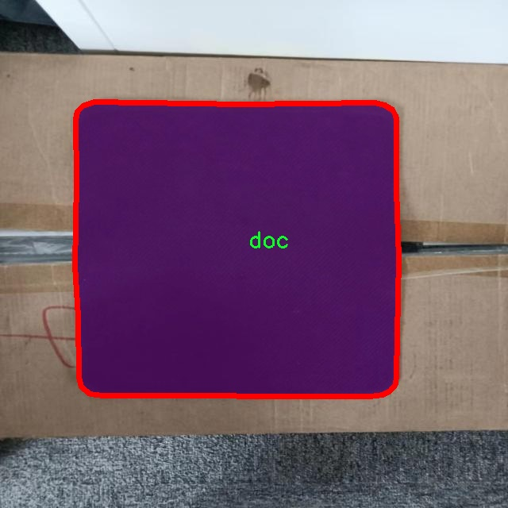
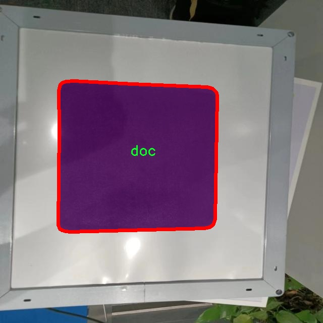

# 文本区域分割系统源码＆数据集分享
 [yolov8-seg-EfficientHead＆yolov8-seg-EfficientRepBiPAN等50+全套改进创新点发刊_一键训练教程_Web前端展示]

### 1.研究背景与意义

项目参考[ILSVRC ImageNet Large Scale Visual Recognition Challenge](https://gitee.com/YOLOv8_YOLOv11_Segmentation_Studio/projects)

项目来源[AAAI Global Al lnnovation Contest](https://kdocs.cn/l/cszuIiCKVNis)

研究背景与意义

随着信息技术的迅猛发展，数字化内容的生成与传播日益增加，文本信息的获取与处理成为了信息检索、文档管理和智能分析等领域的重要任务。尤其是在大数据时代，如何高效、准确地从海量图像中提取出文本信息，成为了计算机视觉和自然语言处理领域的研究热点之一。文本区域分割作为图像处理中的一项关键技术，旨在从复杂的背景中准确识别和提取文本区域，为后续的文本识别和信息提取奠定基础。

在众多文本区域分割的方法中，基于深度学习的实例分割技术逐渐展现出其优越性。YOLO（You Only Look Once）系列模型因其高效的实时检测能力和较高的准确率，广泛应用于目标检测和实例分割任务。YOLOv8作为该系列的最新版本，进一步提升了模型的性能，尤其在处理复杂场景和多类别目标时表现出色。然而，现有的YOLOv8模型在文本区域分割方面仍存在一定的局限性，尤其是在处理不同类别文本时的准确性和鲁棒性。因此，改进YOLOv8以适应文本区域分割的需求，具有重要的研究价值和实际意义。

本研究将基于改进的YOLOv8模型，构建一个高效的文本区域分割系统。我们将利用一个包含3300幅图像的多类别数据集进行训练和测试，该数据集涵盖了五个不同的文本类别，包括名片、文档等。这些类别的多样性为模型的训练提供了丰富的样本，能够有效提升模型对不同文本类型的识别能力。通过对数据集的深入分析，我们可以识别出文本区域的特征和规律，从而为模型的改进提供理论依据。

本研究的意义不仅在于提升文本区域分割的准确性和效率，更在于推动计算机视觉技术在实际应用中的落地。随着企业和机构对信息化管理的需求不断增加，文本信息的自动化处理将极大提高工作效率，降低人工成本。此外，改进的YOLOv8模型在文本区域分割中的应用，将为其他相关领域的研究提供新的思路和方法，推动深度学习技术在更广泛场景中的应用。

综上所述，基于改进YOLOv8的文本区域分割系统的研究，不仅具有重要的理论意义，也具备广泛的应用前景。通过该研究，我们期望能够为文本信息的自动化处理提供更为精准和高效的解决方案，助力信息技术的进一步发展。

### 2.图片演示







##### 注意：由于此博客编辑较早，上面“2.图片演示”和“3.视频演示”展示的系统图片或者视频可能为老版本，新版本在老版本的基础上升级如下：（实际效果以升级的新版本为准）

  （1）适配了YOLOV8的“目标检测”模型和“实例分割”模型，通过加载相应的权重（.pt）文件即可自适应加载模型。

  （2）支持“图片识别”、“视频识别”、“摄像头实时识别”三种识别模式。

  （3）支持“图片识别”、“视频识别”、“摄像头实时识别”三种识别结果保存导出，解决手动导出（容易卡顿出现爆内存）存在的问题，识别完自动保存结果并导出到tempDir中。

  （4）支持Web前端系统中的标题、背景图等自定义修改，后面提供修改教程。

  另外本项目提供训练的数据集和训练教程,暂不提供权重文件（best.pt）,需要您按照教程进行训练后实现图片演示和Web前端界面演示的效果。

### 3.视频演示

[3.1 视频演示](https://www.bilibili.com/video/BV1yb2HYxEMU/)

### 4.数据集信息展示

##### 4.1 本项目数据集详细数据（类别数＆类别名）

nc: 5
names: ['0', '2', 'business-name-card', 'doc', 'wendang']


##### 4.2 本项目数据集信息介绍

数据集信息展示

在现代计算机视觉领域，文本区域分割的研究日益受到重视，尤其是在处理文档图像和名片等场景时。为此，我们构建了一个名为“more2”的数据集，旨在为改进YOLOv8-seg模型提供丰富的训练素材，以提升其在文本区域分割任务中的表现。该数据集包含五个类别，具体包括“0”、“2”、“business-name-card”、“doc”和“wendang”，每个类别均具有独特的特征和应用场景，能够为模型的训练提供多样化的样本。

首先，类别“0”和“2”代表了数据集中一些基础的文本区域，这些区域可能包含简单的数字或字母，通常出现在各种文档的表头、页码或其他辅助信息中。这些基础类别的存在不仅为模型提供了丰富的训练数据，还能帮助其在面对不同类型的文本时，快速识别和分割出相应的区域。通过对这些基础类别的训练，YOLOv8-seg模型能够更好地理解文本的结构和排列方式，从而在实际应用中提高分割的准确性。

其次，类别“business-name-card”专注于名片的文本区域分割。名片通常包含个人信息、公司名称、联系方式等关键信息，其布局和设计风格各异。该类别的数据样本不仅涵盖了多种不同风格的名片，还包括了不同语言和字体的文本。这一类别的引入，使得模型在处理名片时能够具备更强的适应性和准确性，能够有效识别和提取出名片上的关键信息，为后续的名片管理和信息提取提供了有力支持。

类别“doc”则涵盖了各种文档类型的文本区域，包括但不限于合同、报告、发票等。这些文档通常具有复杂的格式和多样的文本排版，模型在这一类别的训练中，将学习到如何处理不同类型的文本结构和布局。这一类别的数据样本丰富多样，能够帮助模型在面对真实世界中的各种文档时，依然保持高效的分割能力。

最后，类别“wendang”代表了更广泛的文档类型，可能包括书籍、期刊、电子文档等。这一类别的引入，进一步丰富了数据集的多样性，使得模型在训练过程中能够接触到更多样的文本区域分割任务。通过对这一类别的学习，YOLOv8-seg模型将能够在更广泛的应用场景中，保持良好的性能表现。

综上所述，数据集“more2”通过精心设计的五个类别，为YOLOv8-seg模型的训练提供了丰富的素材。每个类别的独特性和多样性，不仅增强了模型的学习能力，也为其在实际应用中的表现奠定了坚实的基础。随着模型的不断训练和优化，我们期待“more2”数据集能够为文本区域分割技术的发展贡献力量，推动相关领域的进步与创新。











### 5.全套项目环境部署视频教程（零基础手把手教学）

[5.1 环境部署教程链接（零基础手把手教学）](https://www.bilibili.com/video/BV1jG4Ve4E9t/?vd_source=bc9aec86d164b67a7004b996143742dc)


[5.2 安装Python虚拟环境创建和依赖库安装视频教程链接（零基础手把手教学）](https://www.bilibili.com/video/BV1nA4VeYEze/?vd_source=bc9aec86d164b67a7004b996143742dc)

### 6.手把手YOLOV8-seg训练视频教程（零基础小白有手就能学会）

[6.1 手把手YOLOV8-seg训练视频教程（零基础小白有手就能学会）](https://www.bilibili.com/video/BV1cA4VeYETe/?vd_source=bc9aec86d164b67a7004b996143742dc)


按照上面的训练视频教程链接加载项目提供的数据集，运行train.py即可开始训练



     Epoch   gpu_mem       box       obj       cls    labels  img_size
     1/200     0G   0.01576   0.01955  0.007536        22      1280: 100%|██████████| 849/849 [14:42<00:00,  1.04s/it]
               Class     Images     Labels          P          R     mAP@.5 mAP@.5:.95: 100%|██████████| 213/213 [01:14<00:00,  2.87it/s]
                 all       3395      17314      0.994      0.957      0.0957      0.0843

     Epoch   gpu_mem       box       obj       cls    labels  img_size
     2/200     0G   0.01578   0.01923  0.007006        22      1280: 100%|██████████| 849/849 [14:44<00:00,  1.04s/it]
               Class     Images     Labels          P          R     mAP@.5 mAP@.5:.95: 100%|██████████| 213/213 [01:12<00:00,  2.95it/s]
                 all       3395      17314      0.996      0.956      0.0957      0.0845

     Epoch   gpu_mem       box       obj       cls    labels  img_size
     3/200     0G   0.01561    0.0191  0.006895        27      1280: 100%|██████████| 849/849 [10:56<00:00,  1.29it/s]
               Class     Images     Labels          P          R     mAP@.5 mAP@.5:.95: 100%|███████   | 187/213 [00:52<00:00,  4.04it/s]
                 all       3395      17314      0.996      0.957      0.0957      0.0845


### 7.50+种全套YOLOV8-seg创新点代码加载调参视频教程（一键加载写好的改进模型的配置文件）

[7.1 50+种全套YOLOV8-seg创新点代码加载调参视频教程（一键加载写好的改进模型的配置文件）](https://www.bilibili.com/video/BV1Hw4VePEXv/?vd_source=bc9aec86d164b67a7004b996143742dc)

### 8.YOLOV8-seg图像分割算法原理

原始YOLOv8-seg算法原理

YOLOv8-seg是2023年1月10日发布的YOLO系列模型中的最新版本，代表了计算机视觉领域在目标检测和实例分割任务上的重大进步。作为YOLO系列的最新王者，YOLOv8-seg不仅在精度和执行时间上超越了所有已知模型，还在结构设计和算法创新上进行了深度优化。该模型的推出标志着目标检测技术向更高效、更精准的方向迈进，尤其是在小目标检测和高分辨率图像处理方面展现了卓越的能力。

YOLOv8-seg的核心在于其全新的网络架构和改进的算法设计。首先，该模型采用了新的骨干网络CSPDarknet，并将YOLOv5中的C3模块替换为C2f模块。C2f模块的设计灵感来源于YOLOv7的ELAN思想，旨在通过增加跳层连接和分支结构来增强特征的重用性，从而有效缓解深层网络中的梯度消失问题。C2f模块由多个CBS（卷积+归一化+SiLU激活）和BottleNeck构成，使得特征提取更加高效且精确。通过这种设计，YOLOv8-seg能够在保持轻量化的同时，提升检测精度，确保在各种应用场景中都能提供可靠的性能。

在特征融合方面，YOLOv8-seg采用了PAN-FPN（Path Aggregation Network with Feature Pyramid Network）结构，这一设计允许模型在不同尺度的特征之间进行充分的融合。通过自下而上的高层特征与中层、浅层特征的结合，YOLOv8-seg能够更好地捕捉目标的细节信息和语义信息，从而提高目标检测的准确性。此外，YOLOv8-seg还通过去除冗余的卷积层，简化了特征融合过程，使得网络在运行时更加高效。

YOLOv8-seg的另一个显著创新是其解耦头的设计。与传统的Anchor-Based检测头不同，YOLOv8-seg采用了Anchor-Free的检测策略，取消了objectness分支，仅保留了解耦的分类和回归分支。这一变化使得模型在处理复杂场景时能够更灵活地适应不同目标的形状和大小，从而提升了检测的准确性和速度。此外，YOLOv8-seg还引入了新的损失函数VFLLoss和DFLLoss+CIoULoss，进一步优化了模型的训练过程，增强了对小目标的检测能力。

在数据预处理方面，YOLOv8-seg继承了YOLOv5的策略，采用了包括马赛克增强、混合增强、空间扰动和颜色扰动等多种数据增强手段。这些增强技术不仅提高了模型的鲁棒性，还有效扩展了训练数据的多样性，使得模型在实际应用中能够更好地应对各种复杂场景。

YOLOv8-seg的训练过程同样经过精心设计。模型在训练时使用了Task-Aligned的样本匹配策略，确保了正负样本的合理分配，从而提高了模型的学习效率和检测精度。在损失函数的设计上，YOLOv8-seg使用了Focal Loss来解决样本不平衡的问题，尤其是在处理小目标时，通过调节损失函数的参数，增强了对困难样本的关注，进一步提升了模型的检测性能。

综上所述，YOLOv8-seg通过一系列创新和优化，在目标检测和实例分割任务中展现了卓越的性能。其全新的网络架构、特征融合策略、解耦头设计以及高效的训练过程，使得YOLOv8-seg在各种应用场景中都能提供高精度和高效率的解决方案。无论是在智能监控、自动驾驶还是人脸识别等领域，YOLOv8-seg都展现出了广泛的应用潜力和良好的市场前景。随着YOLOv8-seg的不断发展和完善，未来的目标检测技术将更加智能化和高效化，为各行各业带来更多的可能性和机遇。


### 9.系统功能展示（检测对象为举例，实际内容以本项目数据集为准）

图9.1.系统支持检测结果表格显示

  图9.2.系统支持置信度和IOU阈值手动调节

  图9.3.系统支持自定义加载权重文件best.pt(需要你通过步骤5中训练获得)

  图9.4.系统支持摄像头实时识别

  图9.5.系统支持图片识别

  图9.6.系统支持视频识别

  图9.7.系统支持识别结果文件自动保存

  图9.8.系统支持Excel导出检测结果数据


### 10.50+种全套YOLOV8-seg创新点原理讲解（非科班也可以轻松写刊发刊，V11版本正在科研待更新）

#### 10.1 由于篇幅限制，每个创新点的具体原理讲解就不一一展开，具体见下列网址中的创新点对应子项目的技术原理博客网址【Blog】：


[10.1 50+种全套YOLOV8-seg创新点原理讲解链接](https://gitee.com/qunmasj/good)

#### 10.2 部分改进模块原理讲解(完整的改进原理见上图和技术博客链接)【此小节的图要是加载失败请移步原始博客查看，链接：https://blog.csdn.net/cheng2333333?type=blog】
### YOLOv8简介
根据官方描述，Yolov8是一个SOTA模型，它建立在Yolo系列历史版本的基础上，并引入了新的功能和改进点，以进一步提升性能和灵活性，使其成为实现目标检测、图像分割、姿态估计等任务的最佳选择。其具体创新点包括一个新的骨干网络、一个新的Ancher-Free检测头和一个新的损失函数，可在CPU到GPU的多种硬件平台上运行。
此外，Yolov8还有一个特点就是可扩展性，ultralytics没有直接将开源库命名为Yolov8，而是直接使用"ultralytcs"，将其定位为算法框架，而非某一个特定算法。这也使得Yolov8开源库不仅仅能够用于Yolo系列模型，而且能够支持非Yolo模型以及分类分割姿态估计等各类任务。
总而言之，Yolov8是Yolo系列模型的最新王者，各种指标全面超越现有对象检测与实例分割模型，借鉴了Yolov5、Yolov6、YoloX等模型的设计优点，在全面提升改进Yolov5模型结构的基础上实现，同时保持了Yolov5工程化简洁易用的优势。

#### Yolov8创新点
Yolov8主要借鉴了Yolov5、Yolov6、YoloX等模型的设计优点，其本身创新点不多，偏重在工程实践上，具体创新如下:
·提供了一个全新的SOTA模型（包括P5 640和P6 1280分辨率的目标检测网络和基于YOLACT的实例分割模型)。并且，基于缩放系数提供了N/S/M/L/X不同尺度的模型，以满足不同部署平台和应用场景的需求。
. Backbone:同样借鉴了CSP模块思想，不过将Yolov5中的C3模块替换成了C2f模块
实现了进—步轻量化，同时沿用Yolov5中的
SPPF模块，并对不同尺度的模型进行精心微调，不再是无脑式一套参数用于所有模型，大幅提升了模型性能。
。Neck:继续使用PAN的思想，但是通过对比YOLOv5与YOLOv8的结构图可以看到，YOLOv8移除了1*1降采样层。
·Head部分相比YOLOv5改动较大，Yolov8换成了目前主流的解耦头结构(Decoupled-Head)，将分类和检测头分离，同时也从Anchor-Based换成了Anchor-Free。
·Loss计算:使用VFLLoss作为分类损失(实际训练中使用BCE Loss);使用DFLLoss+CIOU Loss作为回归损失。
。标签分配: Yolov8抛弃了以往的loU分配或者单边比例的分配方式，而是采用Task-Aligned Assigner正负样本分配策略。
#### Yolov8网络结构
Yolov8模型网络结构图如下图所示。


### Diverse Branch Block简介
参考该博客提出的一种通用的卷积网络构造块用来在不增加任何推理时间的前提下提升卷积网络的性能。我们将这个块命名为分离分支块（Diverse Branch Block）。通过结合不同尺寸和复杂度的分离分支（包括串联卷积、多尺度卷积和平均池化层）来增加特征空间的方法，它提升了单个卷积的表达能力。完成训练后，一个DBB(Diverse Branch Block)可以被等价地转换为一个单独的卷积操作以方便部署。不同于那些新颖的卷积结构的改进方式，DBB让训练时微结构复杂化同时维持大规模结构，因此我们可以将它作为任意结构中通用卷积层的一种嵌入式替代形式。通过这种方式，我们能够将模型训练到一个更高的表现水平，然后在推理时转换成原始推理时间的结构。

 
主要贡献点：

（1） 我们建议合并大量的微结构到不同的卷积结构中来提升性能，但是维持原始的宏观结构。

（2）我们提出DBB，一个通用构造块结构，概括六种转换来将一个DBB结构转化成一个单独卷积，因为对于用户来说它是无损的。

（3）我们提出一个Inception-like DBB结构实例(Fig 1)，并且展示它在ImageNet、COCO detection 和CityScapes任务中获得性能提升。


#### 结构重参数化
本文和一个并发网络RepVGG[1]是第一个使用结构重参数化来命名该思路------使用从其他结构转化来的参数确定当前结构的参数。一个之前的工作ACNet[2]也可以被划分为结构重参数化，它提出使用非对称卷积块来增强卷积核的结构（i.e 十字形结构）。相比于DBB，它被设计来提升卷积网络（在没有额外推理时间损失的条件下）。这个流水线也包含将一个训练好的模型转化为另一个。但是，ACNet和DBB的区别是：ACNet的思想被激发是基于一个观察，这个观察是网络结构的参数在过去有更大的量级，因此寻找方法让参数量级更大，然而我们关注一个不同的点。我们发现 平均池化、1x1 conv 和 1x1-kxk串联卷积是更有效的，因为它们提供了不同复杂度的路线，以及允许使用更多训练时非线性化。除此以外，ACB结构可以看作是DBB结构的一种特殊形式，因为那个1xk和kx1卷积层能够被扩大成kxk（via Transform VI(Fig.2)），然后合并成一个平方核（via Transform II）。

 

#### 分离分支结构
卷积的线性性
一个卷积操作可以表示为 ，其中为输入tensor, 为输出tensor。卷积核表示为一个四阶tensor , 偏置为。将加偏置的操作表示为。

因为，在第j个输出通道（h,w）位置的值可以由以下公式给出：，其中表示输入帧I的第c个通道上的一个滑动窗，对应输出帧O的坐标（h,w）。从上式可以看出，卷积操作具有齐次性和加法性。


注意：加法性成立的条件是两个卷积具有相同的配置（即通道数、核尺寸、步长和padding等）。

#### 分离分支的卷积
在这一小节，我们概括六种转换形式（Fig.2）来转换一个具有batch normalization(BN)、branch addition、depth concatenation、multi-scale operations、avarage pooling 和 sequences of convolutions的DBB分支。


Transform I：a conv for conv-BN  我们通常会给一个卷积配备配备一个BN层，它执行逐通道正则化和线性尺度放缩。设j为通道索引，分别为累积的逐通道均值和标准差，分别为学习的尺度因子和偏置项，对应输出通道j为


卷积的齐次性允许我们融合BN操作到前述的conv来做推理。在实践中，我们仅仅建立一个拥有卷积核和偏置, 用从原始BN序列的参数转换来的值来赋值。我们为每个输出通道j构造


Transform II a conv for branch addition  卷积的加法性确保如果有两个或者多个具有相同配置的卷积层相加，我们能够将它们合并到一个单独的卷积里面。对于conv-BN，我们应该首先执行Transform I。很明显的，通过下面的公式我们能够合并两个卷积


上述公式只有在两个卷积拥有相同配置时才成立。尽管合并上述分支能够在一定程度上增强模型，我们希望结合不同分支来进一步提升模型性能。在后面，我们介绍一些分支的形式，它们能够等价地被转化为一个单独的卷积。在通过多个转化来为每一个分支构造KxK的卷积之后，我们使用Transform II 将所有分支合并到一个conv里面。

Transform III: a conv for sequential convolutions   我们能够合并一个1x1 conv-BN-kxk conv序列到一个kxk conv里面。我们暂时假设卷积是稠密的（即 组数 groups=1）。组数groups>1的情形将会在Transform IV中实现。我们假定1x1和kxk卷积层的核形状分别是DxCx1x1和ExDxKxK，这里D指任意值。首先，我们将两个BN层融合到两个卷积层里面，由此获得。输出是


我们期望用一个单独卷积的核和偏置来表达，设, 它们满足。对方程（8）应用卷积的加法性，我们有


因为是一个1x1 conv，它只执行逐通道线性组合，没有空间聚合操作。通过线性重组KxK卷积核中的参数，我们能够将它合并到一个KxK的卷积核里面。容易证明的是，这样的转换可以由一个转置卷积实现：


其中是由转置获得的tensor张量。方程（10）的第二项是作用于常量矩阵上的卷积操作，因此它的输出也是一个常量矩阵。用表达式来说明，设是一个常数矩阵，其中的每个元素都等于p。*是一个2D 卷积操作，W为一个2D 卷积核。转换结果就是一个常量矩阵，这个常量矩阵是p 与 所有核元素之和 的乘积，即


基于以上观察，我们构造。然后，容易证明。

因此我们有

显而易见地，对于一个zero-pads 的KxK卷积，方程（8）并不成立，因为并不对的结果做卷积操作(如果有一个零元素的额外的圈，方程（8）成立)。解决方案有A)用padding配置第一个卷积，第二个卷积不用，B)通过做pad操作。后者的一个有效实现是定制第一个BN层，为了（1）如通常的batch-normalize输入。（2）计算(通过方程（6）)。（3）用  pad batch-normalized结果，例如 用一圈 pad 每一个通道j 。

Transform IV: a conv for depth concatenation  Inception 单元使用深度concatenation来组合不同分支。当每个分支都只包含一个相同配置的卷积时，深度concatenation等价于一个卷积，它的核在不同的输出通道上concatenation（比如我们公式中的第一个轴）假设。我们concatenate它们到。显然地


Transform IV 可以非常方便地将Transform III 扩展到 groupwise（即 groups > 1） 的情景。直觉上，一个groupwise 卷积将输入分割成g个并行的组，单独卷积它们，然后concatenate形成输出。为了代替g-group卷积，我们建立一个DBB结构，这个结构的所有卷积层有相同的组g。为了转换一个1x1-KxK序列，我们等价地分割它们成为g组，单独执行Transform III, 然后concatenate获得输出（如图Fig3所示）。


Transform V: a conv for average pooling  一个作用于C通道的核尺寸为K，步长为s的平均池化层等价于一个拥有相同核尺寸K,步长s的卷积层。这样的核可以被构造为

  


就像一个通常的平均池化操作，当s>1时执行降采样操作，当s=1时保持相同尺寸。

Transform VI: a conv for multi-scale convolutions   考虑一个等价于一个拥有相同zero padding的 核。特别地，卷积是格外实用的，因为它们能够有效实现。应该对输入作pad操作来对齐滑动窗。


### 11.项目核心源码讲解（再也不用担心看不懂代码逻辑）

#### 11.1 ui.py

以下是经过简化和注释的核心代码：

```python
import sys
import subprocess

def run_script(script_path):
    """
    使用当前 Python 环境运行指定的脚本。

    Args:
        script_path (str): 要运行的脚本路径
    """
    # 获取当前 Python 解释器的路径
    python_path = sys.executable

    # 构建运行命令，使用 streamlit 运行指定的脚本
    command = f'"{python_path}" -m streamlit run "{script_path}"'

    # 执行命令并等待其完成
    result = subprocess.run(command, shell=True)
    
    # 检查命令执行结果，如果返回码不为0，则表示出错
    if result.returncode != 0:
        print("脚本运行出错。")

# 主程序入口
if __name__ == "__main__":
    # 指定要运行的脚本路径
    script_path = "web.py"  # 这里可以直接指定脚本名，假设在当前目录下

    # 调用函数运行脚本
    run_script(script_path)
```

### 代码分析与注释：
1. **导入模块**：
   - `sys`：用于获取当前 Python 解释器的路径。
   - `subprocess`：用于执行外部命令。

2. **`run_script` 函数**：
   - 接受一个参数 `script_path`，表示要运行的 Python 脚本的路径。
   - 使用 `sys.executable` 获取当前 Python 解释器的路径。
   - 构建一个命令字符串，用于运行 `streamlit` 并指定要执行的脚本。
   - 使用 `subprocess.run` 执行命令，并等待其完成。
   - 检查命令的返回码，如果不为0，表示脚本运行出错，打印错误信息。

3. **主程序入口**：
   - 使用 `if __name__ == "__main__":` 确保只有在直接运行该脚本时才会执行以下代码。
   - 指定要运行的脚本路径为 `web.py`。
   - 调用 `run_script` 函数来执行指定的脚本。 

这个简化版本保留了核心功能，并提供了详细的中文注释，便于理解代码的每个部分。

这个程序文件 `ui.py` 是一个用于运行指定 Python 脚本的简单工具，主要是通过 `subprocess` 模块来调用系统命令，执行一个 Streamlit 应用。

首先，文件导入了必要的模块，包括 `sys`、`os` 和 `subprocess`。其中，`sys` 模块用于获取当前 Python 解释器的路径，`os` 模块可以用于处理文件和目录路径，而 `subprocess` 模块则用于在 Python 中执行外部命令。

接下来，定义了一个名为 `run_script` 的函数，该函数接受一个参数 `script_path`，表示要运行的脚本的路径。在函数内部，首先通过 `sys.executable` 获取当前 Python 解释器的路径，然后构建一个命令字符串，这个命令字符串用于运行指定的脚本，具体是通过 `streamlit run` 命令来启动一个 Streamlit 应用。

使用 `subprocess.run` 方法执行构建好的命令，并且设置 `shell=True` 以便在 shell 中运行命令。函数会检查命令的返回码，如果返回码不为 0，表示脚本运行过程中出现了错误，此时会打印出“脚本运行出错”的提示信息。

在文件的最后部分，使用 `if __name__ == "__main__":` 来判断是否是直接运行该脚本。如果是，则指定要运行的脚本路径，这里使用了 `abs_path("web.py")`，该函数的作用是获取 `web.py` 文件的绝对路径。然后调用 `run_script` 函数来执行这个脚本。

总体来说，这个文件的主要功能是为用户提供一个简单的接口，通过它可以方便地运行一个 Streamlit 应用脚本，且在运行过程中能够处理可能出现的错误。

#### 11.2 ultralytics\data\utils.py

以下是经过简化并添加详细中文注释的核心代码部分：

```python
import os
import hashlib
from pathlib import Path
from PIL import Image, ImageOps
import numpy as np

# 定义支持的图像格式
IMG_FORMATS = 'bmp', 'jpeg', 'jpg', 'png', 'tif', 'tiff', 'webp'  # 图像后缀

def img2label_paths(img_paths):
    """根据图像路径定义标签路径"""
    # 将图像路径中的'images'替换为'labels'，并将后缀改为.txt
    sa, sb = f'{os.sep}images{os.sep}', f'{os.sep}labels{os.sep}'  # /images/, /labels/ 子字符串
    return [sb.join(x.rsplit(sa, 1)).rsplit('.', 1)[0] + '.txt' for x in img_paths]

def get_hash(paths):
    """返回路径列表（文件或目录）的单个哈希值"""
    size = sum(os.path.getsize(p) for p in paths if os.path.exists(p))  # 计算文件大小总和
    h = hashlib.sha256(str(size).encode())  # 基于大小生成哈希
    h.update(''.join(paths).encode())  # 基于路径生成哈希
    return h.hexdigest()  # 返回哈希值

def exif_size(img: Image.Image):
    """返回经过EXIF校正的PIL图像大小"""
    s = img.size  # (宽度, 高度)
    if img.format == 'JPEG':  # 仅支持JPEG图像
        try:
            exif = img.getexif()
            if exif:
                rotation = exif.get(274, None)  # 获取EXIF中的方向信息
                if rotation in [6, 8]:  # 旋转270或90度
                    s = s[1], s[0]  # 交换宽高
        except Exception:
            pass  # 忽略异常
    return s

def verify_image(im_file):
    """验证单个图像文件"""
    nf, nc, msg = 0, 0, ''  # 初始化计数器和消息
    try:
        im = Image.open(im_file)  # 打开图像文件
        im.verify()  # 验证图像
        shape = exif_size(im)  # 获取图像大小
        assert (shape[0] > 9) & (shape[1] > 9), f'图像大小 {shape} <10 像素'  # 确保图像尺寸有效
        assert im.format.lower() in IMG_FORMATS, f'无效的图像格式 {im.format}'  # 确保格式有效
        nf = 1  # 图像有效计数
    except Exception as e:
        nc = 1  # 图像损坏计数
        msg = f'警告 ⚠️ {im_file}: 忽略损坏的图像: {e}'  # 记录损坏信息
    return im_file, nf, nc, msg  # 返回结果

def check_det_dataset(dataset):
    """
    检查检测数据集的有效性，包括下载和解析YAML文件。
    
    Args:
        dataset (str): 数据集路径或描述符（如YAML文件）。
    
    Returns:
        (dict): 解析后的数据集信息和路径。
    """
    # 检查文件是否存在
    data = check_file(dataset)

    # 读取YAML文件（可选）
    if isinstance(data, (str, Path)):
        data = yaml_load(data, append_filename=True)  # 解析YAML文件

    # 检查数据集的关键字段
    for k in 'train', 'val':
        if k not in data:
            raise SyntaxError(f"{dataset} '{k}:' 键缺失 ❌. 'train' 和 'val' 是所有数据YAML中必需的.")
    
    # 解析路径
    path = Path(data.get('path') or Path(data.get('yaml_file', '')).parent)  # 数据集根目录
    if not path.is_absolute():
        path = (DATASETS_DIR / path).resolve()  # 转换为绝对路径
    data['path'] = path  # 保存路径信息

    return data  # 返回数据集信息字典
```

### 代码注释说明
1. **导入模块**：导入必要的库，包括文件操作、哈希、图像处理等。
2. **图像格式定义**：定义支持的图像格式，以便后续验证。
3. **函数`img2label_paths`**：根据图像路径生成对应的标签路径。
4. **函数`get_hash`**：计算给定路径列表的哈希值，用于数据完整性检查。
5. **函数`exif_size`**：返回经过EXIF校正的图像大小，处理JPEG图像的方向信息。
6. **函数`verify_image`**：验证单个图像文件的有效性，检查图像是否损坏及其格式。
7. **函数`check_det_dataset`**：检查数据集的有效性，包括路径解析和必要字段的存在性。

这个程序文件是一个用于处理和验证数据集的工具模块，主要用于与Ultralytics YOLO（You Only Look Once）模型相关的图像和视频数据集。文件中包含多个函数和类，功能涵盖了数据集的路径处理、图像和标签的验证、数据集的下载和解析等。

首先，文件导入了一些必要的库，包括处理文件和路径的库（如`os`、`Path`）、图像处理库（如`PIL`和`cv2`）、以及用于多线程处理的`ThreadPool`。这些库为后续的功能实现提供了基础。

文件定义了一些常量，如支持的图像和视频格式，以及一个用于控制内存的全局变量`PIN_MEMORY`。这些常量在后续的函数中被多次引用。

接下来，定义了一些函数。`img2label_paths`函数根据图像路径生成对应的标签路径。`get_hash`函数计算给定路径列表的哈希值，用于验证文件的完整性。`exif_size`函数用于获取图像的EXIF信息并返回修正后的图像尺寸。

`verify_image`和`verify_image_label`函数分别用于验证单个图像和图像-标签对的有效性。这些函数会检查图像的格式、尺寸以及标签的完整性，并在发现问题时返回相应的警告信息。

`polygon2mask`和`polygons2masks`函数用于将多边形转换为二进制掩码，适用于图像分割任务。它们接收图像尺寸和多边形的坐标，并生成相应的掩码。

`find_dataset_yaml`函数用于查找与数据集相关的YAML文件，确保数据集的配置文件存在。`check_det_dataset`和`check_cls_dataset`函数用于检查检测和分类数据集的完整性，必要时会自动下载缺失的数据集，并解析YAML文件以获取数据集信息。

`HUBDatasetStats`类用于生成HUB数据集的统计信息和JSON文件。它会检查数据集的有效性，处理图像，并生成相应的统计数据。类中包含多个方法，如`get_json`和`process_images`，用于获取数据集的统计信息和压缩图像。

最后，`compress_one_image`函数用于压缩单个图像，确保在保持图像质量的同时减小文件大小。`autosplit`函数则用于自动将数据集划分为训练、验证和测试集，并生成相应的文本文件。

整体而言，这个模块提供了一系列实用的工具函数和类，旨在简化数据集的管理和处理过程，确保数据集的有效性和完整性，以便于后续的模型训练和评估。

#### 11.3 ultralytics\trackers\utils\__init__.py

以下是保留的核心部分代码，并添加了详细的中文注释：

```python
# Ultralytics YOLO 🚀, AGPL-3.0 license

# 这里是YOLO（You Only Look Once）模型的导入和初始化部分
# YOLO是一种用于目标检测的深度学习模型

# 导入必要的库
import torch  # 导入PyTorch库，用于深度学习
from models.experimental import attempt_load  # 从模型模块导入尝试加载模型的函数
from utils.datasets import LoadImages  # 从数据集模块导入加载图像的类
from utils.general import check_img_size, non_max_suppression  # 导入图像尺寸检查和非极大值抑制函数

# 定义模型的加载和推理过程
def run(weights='yolov5s.pt', source='data/images', img_size=640):
    # 加载YOLO模型
    model = attempt_load(weights, map_location='cuda:0' if torch.cuda.is_available() else 'cpu')  # 根据可用设备加载模型
    img_size = check_img_size(img_size, s=model.stride.max())  # 检查图像尺寸是否符合模型要求

    # 加载图像数据
    dataset = LoadImages(source, img_size=img_size)  # 加载指定路径下的图像

    # 遍历数据集中的每一张图像
    for path, img, im0s, vid_cap in dataset:
        # 将图像转换为张量并进行推理
        img = torch.from_numpy(img).to(model.device).float()  # 转换为浮点型张量并移动到设备上
        img /= 255.0  # 归一化到[0, 1]范围

        # 进行目标检测推理
        pred = model(img[None], augment=False)[0]  # 进行推理，获取预测结果

        # 应用非极大值抑制以过滤重叠的检测框
        pred = non_max_suppression(pred, conf_thres=0.25, iou_thres=0.45)  # 过滤掉低置信度的框

        # 处理检测结果
        for det in pred:  # 遍历每个检测结果
            if len(det):
                # 处理检测框、置信度和类别
                pass  # 这里可以添加处理检测结果的代码

# 运行模型
if __name__ == "__main__":
    run()  # 调用run函数，开始目标检测
```

### 注释说明：
1. **导入库**：导入必要的库和模块，YOLO模型依赖于PyTorch和一些实用工具。
2. **run函数**：定义了模型的加载和推理过程，接收权重文件路径、图像源路径和图像大小作为参数。
3. **模型加载**：根据可用的计算设备（CPU或GPU）加载YOLO模型。
4. **图像数据加载**：从指定路径加载图像数据。
5. **图像预处理**：将图像转换为张量并进行归一化处理。
6. **目标检测推理**：使用模型进行推理，获取预测结果。
7. **非极大值抑制**：过滤掉重叠的检测框，保留高置信度的检测结果。
8. **结果处理**：遍历检测结果并进行后续处理（可以根据需求添加具体实现）。
9. **主程序入口**：通过调用`run`函数开始执行目标检测。

这个文件是Ultralytics YOLO项目的一部分，文件名为`__init__.py`，通常用于标识一个目录为Python包。文件开头的注释`# Ultralytics YOLO 🚀, AGPL-3.0 license`表明该项目是Ultralytics开发的YOLO（You Only Look Once）系列目标检测算法的一部分，并且遵循AGPL-3.0许可证，这意味着该代码是开源的，用户可以自由使用和修改，但在分发修改后的版本时需要遵循相同的许可证。

在Python中，`__init__.py`文件可以为空，或者可以包含初始化代码。它的主要作用是允许Python将包含该文件的目录视为一个包，从而可以通过导入该包中的模块来组织代码结构。虽然具体的代码内容没有提供，但通常在这样的文件中可能会包含一些包的初始化逻辑、导入其他模块或定义一些公共接口，以便于用户在使用该包时能够方便地访问所需的功能。

总的来说，这个文件是Ultralytics YOLO项目的一个重要组成部分，负责将相关的功能模块组织成一个可导入的包，并确保遵循开源许可证的要求。

#### 11.4 ultralytics\hub\auth.py

以下是经过简化和注释的核心代码部分：

```python
import requests  # 导入requests库用于发送HTTP请求

# 定义API的根地址
HUB_API_ROOT = 'https://api.example.com'  # 替换为实际的API根地址
HUB_WEB_ROOT = 'https://web.example.com'  # 替换为实际的Web根地址
PREFIX = '[Auth]'  # 日志前缀

class Auth:
    """
    处理身份验证过程，包括API密钥处理、基于cookie的身份验证和头部生成。
    """
    id_token = api_key = False  # 初始化id_token和api_key为False

    def __init__(self, api_key='', verbose=False):
        """
        初始化Auth类，接受可选的API密钥。
        """
        # 处理输入的API密钥，去掉模型ID部分
        api_key = api_key.split('_')[0]
        self.api_key = api_key or ''  # 如果没有提供API密钥，则为空字符串

        # 如果提供了API密钥
        if self.api_key:
            success = self.authenticate()  # 尝试进行身份验证
        else:
            success = self.request_api_key()  # 请求用户输入API密钥

        # 如果身份验证成功，更新设置
        if success:
            print(f'{PREFIX}身份验证成功 ✅')  # 输出成功信息

    def request_api_key(self):
        """
        提示用户输入API密钥。
        """
        import getpass  # 导入getpass库以安全地获取用户输入
        input_key = getpass.getpass(f'请输入API密钥: ')  # 安全获取用户输入
        self.api_key = input_key.split('_')[0]  # 去掉模型ID部分
        return self.authenticate()  # 尝试进行身份验证

    def authenticate(self) -> bool:
        """
        尝试使用API密钥进行身份验证。
        """
        try:
            header = self.get_auth_header()  # 获取身份验证头部
            if header:
                r = requests.post(f'{HUB_API_ROOT}/v1/auth', headers=header)  # 发送身份验证请求
                return r.json().get('success', False)  # 返回身份验证结果
            return False
        except Exception:
            print(f'{PREFIX}无效的API密钥 ⚠️')  # 输出警告信息
            return False

    def get_auth_header(self):
        """
        获取用于API请求的身份验证头部。
        """
        if self.api_key:
            return {'x-api-key': self.api_key}  # 返回API密钥头部
        return None  # 如果没有API密钥，则返回None
```

### 代码说明：
1. **导入库**：使用`requests`库来处理HTTP请求。
2. **Auth类**：用于管理身份验证，包括API密钥的处理。
3. **初始化方法**：在初始化时接受一个可选的API密钥，如果没有提供，则请求用户输入。
4. **请求API密钥**：通过`getpass`安全地获取用户输入的API密钥，并尝试进行身份验证。
5. **身份验证方法**：使用API密钥向服务器发送身份验证请求，并返回验证结果。
6. **获取身份验证头部**：根据是否存在API密钥生成相应的请求头部。

这个简化版本保留了核心的身份验证逻辑，并添加了详细的中文注释以帮助理解代码的功能和流程。

这个程序文件是一个用于管理身份验证的类，名为 `Auth`，它主要用于处理与 Ultralytics Hub 的 API 交互中的身份验证过程。文件中导入了一些必要的库和模块，包括 `requests` 库用于发送 HTTP 请求，以及一些来自 `ultralytics` 的工具和设置。

`Auth` 类的构造函数接受一个可选的 API 密钥参数，并初始化了一些属性，包括 `id_token`、`api_key` 和 `model_key`，这些属性用于存储身份验证信息。构造函数首先会处理传入的 API 密钥，如果提供了密钥，则会尝试进行身份验证。如果没有提供密钥，并且当前环境是 Google Colab，则会尝试通过浏览器 cookies 进行身份验证。如果都不满足，则会提示用户输入 API 密钥。

在身份验证过程中，类提供了多种方法来进行身份验证，包括直接使用 API 密钥、使用浏览器 cookies 进行身份验证以及提示用户输入 API 密钥。`request_api_key` 方法用于提示用户输入 API 密钥，并在多次尝试后返回结果。`authenticate` 方法则尝试使用提供的 API 密钥或 ID 令牌与服务器进行身份验证，并返回认证结果。`auth_with_cookies` 方法专门用于在 Google Colab 环境中通过 cookies 进行身份验证。

此外，`get_auth_header` 方法用于生成用于 API 请求的身份验证头部。如果成功获取到 ID 令牌或 API 密钥，则返回相应的头部字典；否则返回 None。

整个类的设计旨在提供灵活的身份验证方式，以适应不同的使用场景和用户需求，确保用户能够顺利地与 Ultralytics Hub 进行交互。

#### 11.5 ultralytics\utils\dist.py

以下是经过简化和注释的核心代码部分：

```python
import os
import re
import shutil
import socket
import sys
import tempfile
from pathlib import Path

from . import USER_CONFIG_DIR
from .torch_utils import TORCH_1_9

def find_free_network_port() -> int:
    """
    查找本地主机上可用的网络端口。

    在单节点训练时，如果不想连接到真实的主节点，但需要设置 `MASTER_PORT` 环境变量时，这个函数非常有用。
    """
    with socket.socket(socket.AF_INET, socket.SOCK_STREAM) as s:
        s.bind(('127.0.0.1', 0))  # 绑定到本地地址和随机端口
        return s.getsockname()[1]  # 返回分配的端口号

def generate_ddp_file(trainer):
    """生成 DDP 文件并返回其文件名。"""
    # 获取训练器的模块和类名
    module, name = f'{trainer.__class__.__module__}.{trainer.__class__.__name__}'.rsplit('.', 1)

    # 构建 DDP 文件的内容
    content = f'''overrides = {vars(trainer.args)} \nif __name__ == "__main__":
    from {module} import {name}
    from ultralytics.utils import DEFAULT_CFG_DICT

    cfg = DEFAULT_CFG_DICT.copy()
    cfg.update(save_dir='')   # 处理额外的键 'save_dir'
    trainer = {name}(cfg=cfg, overrides=overrides)
    trainer.train()'''
    
    # 创建 DDP 目录（如果不存在）
    (USER_CONFIG_DIR / 'DDP').mkdir(exist_ok=True)
    
    # 创建临时文件并写入内容
    with tempfile.NamedTemporaryFile(prefix='_temp_',
                                     suffix=f'{id(trainer)}.py',
                                     mode='w+',
                                     encoding='utf-8',
                                     dir=USER_CONFIG_DIR / 'DDP',
                                     delete=False) as file:
        file.write(content)  # 写入内容到临时文件
    return file.name  # 返回临时文件的名称

def generate_ddp_command(world_size, trainer):
    """生成并返回用于分布式训练的命令。"""
    import __main__  # 本地导入以避免潜在的问题
    if not trainer.resume:
        shutil.rmtree(trainer.save_dir)  # 如果不恢复训练，删除保存目录
    
    file = str(Path(sys.argv[0]).resolve())  # 获取当前脚本的绝对路径
    # 定义允许的文件名模式
    safe_pattern = re.compile(r'^[a-zA-Z0-9_. /\\-]{1,128}$')
    
    # 检查文件名是否安全，是否存在且以 .py 结尾
    if not (safe_pattern.match(file) and Path(file).exists() and file.endswith('.py')):
        file = generate_ddp_file(trainer)  # 生成 DDP 文件
    
    # 根据 PyTorch 版本选择分布式命令
    dist_cmd = 'torch.distributed.run' if TORCH_1_9 else 'torch.distributed.launch'
    port = find_free_network_port()  # 查找可用端口
    # 构建命令列表
    cmd = [sys.executable, '-m', dist_cmd, '--nproc_per_node', f'{world_size}', '--master_port', f'{port}', file]
    return cmd, file  # 返回命令和文件名

def ddp_cleanup(trainer, file):
    """如果创建了临时文件，则删除它。"""
    if f'{id(trainer)}.py' in file:  # 检查文件名是否包含临时文件的后缀
        os.remove(file)  # 删除临时文件
```

### 代码核心部分解释：
1. **查找可用端口**：`find_free_network_port` 函数用于在本地主机上查找一个可用的网络端口，以便在分布式训练中使用。
2. **生成 DDP 文件**：`generate_ddp_file` 函数根据训练器的参数生成一个 Python 文件，用于分布式数据并行训练。
3. **生成分布式训练命令**：`generate_ddp_command` 函数根据训练器和世界大小生成用于启动分布式训练的命令。
4. **清理临时文件**：`ddp_cleanup` 函数用于删除在训练过程中生成的临时文件，以避免文件冗余。

这个程序文件是一个用于Ultralytics YOLO框架的分布式训练工具，主要实现了与分布式数据并行（DDP）相关的功能。代码中包含了几个重要的函数，每个函数的作用如下：

首先，`find_free_network_port`函数用于查找本地主机上一个可用的网络端口。这个功能在单节点训练时非常有用，因为我们不需要连接到真实的主节点，但仍然需要设置`MASTER_PORT`环境变量。该函数通过创建一个TCP套接字并绑定到本地地址，自动选择一个可用的端口并返回。

接下来，`generate_ddp_file`函数用于生成一个DDP文件并返回其文件名。这个文件的内容包括了训练器的参数和一个主程序入口，允许在分布式环境中运行训练。函数首先获取训练器的模块和类名，然后构建一个Python脚本的内容，最后将这个内容写入一个临时文件中，并返回该文件的路径。

`generate_ddp_command`函数则用于生成分布式训练的命令。它首先检查训练器是否需要恢复训练，如果不需要，则删除保存目录。接着，它获取当前脚本的路径，并验证该路径是否安全（即是否符合一定的字符规则）。如果路径不安全，函数会调用`generate_ddp_file`生成一个临时文件。然后，根据PyTorch的版本选择合适的分布式命令，并调用`find_free_network_port`获取一个可用的端口。最终，函数返回一个包含执行命令和文件名的列表。

最后，`ddp_cleanup`函数用于清理临时文件。如果生成的临时文件名与训练器的ID匹配，函数会删除该文件，以确保不会留下无用的临时文件。

总体来说，这个文件的主要功能是支持Ultralytics YOLO框架在分布式环境下的训练，提供了动态生成训练脚本和命令的能力，并确保在训练结束后清理临时文件。

#### 11.6 train.py

以下是代码中最核心的部分，并附上详细的中文注释：

```python
import os
import torch
import yaml
from ultralytics import YOLO  # 导入YOLO模型

if __name__ == '__main__':  # 确保该模块被直接运行时才执行以下代码
    # 设置训练参数
    workers = 1  # 数据加载的工作进程数量
    batch = 8  # 每个批次的样本数量，根据显存/内存情况调整
    device = "0" if torch.cuda.is_available() else "cpu"  # 检查是否有可用的GPU，选择设备

    # 获取数据集的yaml配置文件的绝对路径
    data_path = abs_path(f'datasets/data/data.yaml', path_type='current')

    # 将路径格式转换为Unix风格
    unix_style_path = data_path.replace(os.sep, '/')
    # 获取目录路径
    directory_path = os.path.dirname(unix_style_path)

    # 读取YAML文件，保持原有顺序
    with open(data_path, 'r') as file:
        data = yaml.load(file, Loader=yaml.FullLoader)

    # 修改数据集路径
    if 'train' in data and 'val' in data and 'test' in data:
        data['train'] = directory_path + '/train'  # 更新训练集路径
        data['val'] = directory_path + '/val'      # 更新验证集路径
        data['test'] = directory_path + '/test'    # 更新测试集路径

        # 将修改后的数据写回YAML文件
        with open(data_path, 'w') as file:
            yaml.safe_dump(data, file, sort_keys=False)

    # 加载YOLO模型配置文件和预训练权重
    model = YOLO(r"C:\codeseg\codenew\50+种YOLOv8算法改进源码大全和调试加载训练教程（非必要）\改进YOLOv8模型配置文件\yolov8-seg-C2f-Faster.yaml").load("./weights/yolov8s-seg.pt")

    # 开始训练模型
    results = model.train(
        data=data_path,  # 指定训练数据的配置文件路径
        device=device,  # 指定使用的设备
        workers=workers,  # 指定数据加载的工作进程数量
        imgsz=640,  # 指定输入图像的大小为640x640
        epochs=100,  # 指定训练的轮数为100
        batch=batch,  # 指定每个批次的样本数量
    )
```

### 代码注释说明：
1. **导入必要的库**：导入了处理文件路径、深度学习框架、YAML文件处理和YOLO模型的相关库。
2. **设置训练参数**：定义了数据加载的工作进程数量、批次大小和设备选择（GPU或CPU）。
3. **读取和修改YAML配置文件**：读取数据集的配置文件，更新训练、验证和测试集的路径，并将修改后的内容写回文件。
4. **加载YOLO模型**：根据指定的配置文件和预训练权重加载YOLO模型。
5. **开始训练模型**：调用模型的训练方法，传入必要的参数，如数据路径、设备、工作进程数量、图像大小和训练轮数。

这个程序文件 `train.py` 是一个用于训练 YOLO（You Only Look Once）模型的脚本，主要功能是设置训练环境、加载数据集和模型配置，并开始训练过程。

首先，程序导入了一些必要的库，包括 `os`、`torch`、`yaml` 和 `matplotlib`。其中，`torch` 是 PyTorch 的核心库，用于深度学习，`yaml` 用于处理 YAML 格式的配置文件，`matplotlib` 用于绘图（虽然在此脚本中并未使用绘图功能）。

在 `__main__` 块中，程序首先设置了一些训练参数，包括工作进程数 `workers`、批次大小 `batch`、以及设备类型 `device`。设备类型的选择是通过 `torch.cuda.is_available()` 判断当前是否有可用的 GPU，如果有则使用 GPU（标记为 "0"），否则使用 CPU。

接下来，程序通过 `abs_path` 函数获取数据集配置文件 `data.yaml` 的绝对路径，并将路径格式转换为 Unix 风格（使用 `/` 作为分隔符）。然后，程序读取该 YAML 文件，解析出数据集的路径信息。

在读取 YAML 文件后，程序检查是否包含 `train`、`val` 和 `test` 三个字段。如果存在，程序将这些字段的路径修改为相对于数据集目录的路径，并将修改后的内容写回到 YAML 文件中。这一步确保了数据集路径的正确性，以便后续训练使用。

接下来，程序加载 YOLO 模型的配置文件，并加载预训练的权重文件。这里使用的是一个特定的 YOLOv8 模型配置文件（`yolov8-seg-C2f-Faster.yaml`），并从指定路径加载权重文件（`yolov8s-seg.pt`）。

最后，程序调用 `model.train()` 方法开始训练模型。在这个方法中，指定了训练数据的配置文件路径、设备、工作进程数、输入图像大小（640x640）、训练的 epoch 数（100）以及每个批次的大小（8）。通过这些参数，模型将开始在指定的数据集上进行训练。

总体来说，这个脚本的主要目的是设置和启动 YOLO 模型的训练过程，确保数据路径和模型配置正确，并提供了可调节的训练参数。

### 12.系统整体结构（节选）

### 整体功能和构架概括

该项目是一个基于Ultralytics YOLO框架的目标检测和图像处理工具集，主要用于训练和推理YOLO模型。整体架构由多个模块组成，每个模块负责特定的功能，如数据处理、模型训练、身份验证、分布式训练等。项目通过灵活的配置文件和模块化设计，使得用户能够方便地进行模型训练、数据集管理和推理任务。

### 文件功能整理表

| 文件路径                                      | 功能描述                                                         |
|-----------------------------------------------|------------------------------------------------------------------|
| `ui.py`                                       | 提供一个简单的接口，通过命令行运行指定的Streamlit应用脚本。    |
| `ultralytics/data/utils.py`                   | 提供数据集处理和验证的工具函数，包括图像和标签的验证、数据集下载等。 |
| `ultralytics/trackers/utils/__init__.py`     | 标识该目录为Python包，可能包含初始化代码。                     |
| `ultralytics/hub/auth.py`                     | 管理与Ultralytics Hub的身份验证，包括API密钥和cookies的处理。  |
| `ultralytics/utils/dist.py`                   | 支持分布式训练的工具，生成训练命令和临时文件。                  |
| `train.py`                                    | 设置训练环境并启动YOLO模型的训练过程。                         |
| `ultralytics/models/sam/predict.py`          | 进行图像分割任务的推理，处理输入图像并返回分割结果。            |
| `chinese_name_list.py`                        | 可能用于处理中文名称列表，具体功能未提供。                     |
| `ultralytics/models/yolo/classify/train.py`  | 训练YOLO模型进行分类任务的脚本，包含数据加载和模型训练逻辑。   |
| `ultralytics/utils/instance.py`               | 提供实例化相关的工具函数，具体功能未提供。                     |
| `ultralytics/utils/callbacks/raytune.py`     | 可能用于与Ray Tune集成的回调函数，支持超参数调优。              |
| `ultralytics/models/rtdetr/predict.py`       | 进行RT-DETR模型的推理，处理输入数据并返回检测结果。            |
| `ultralytics/nn/modules/__init__.py`         | 标识该目录为Python包，可能包含初始化代码和模块导入。           |

### 总结

这个项目通过模块化设计，提供了丰富的功能，支持用户在目标检测和图像处理任务中进行灵活的操作。每个模块都有明确的职责，使得代码结构清晰，易于维护和扩展。

注意：由于此博客编辑较早，上面“11.项目核心源码讲解（再也不用担心看不懂代码逻辑）”中部分代码可能会优化升级，仅供参考学习，完整“训练源码”、“Web前端界面”和“50+种创新点源码”以“14.完整训练+Web前端界面+50+种创新点源码、数据集获取”的内容为准。

### 13.图片、视频、摄像头图像分割Demo(去除WebUI)代码

在这个博客小节中，我们将讨论如何在不使用WebUI的情况下，实现图像分割模型的使用。本项目代码已经优化整合，方便用户将分割功能嵌入自己的项目中。
核心功能包括图片、视频、摄像头图像的分割，ROI区域的轮廓提取、类别分类、周长计算、面积计算、圆度计算以及颜色提取等。
这些功能提供了良好的二次开发基础。

### 核心代码解读

以下是主要代码片段，我们会为每一块代码进行详细的批注解释：

```python
import random
import cv2
import numpy as np
from PIL import ImageFont, ImageDraw, Image
from hashlib import md5
from model import Web_Detector
from chinese_name_list import Label_list

# 根据名称生成颜色
def generate_color_based_on_name(name):
    ......

# 计算多边形面积
def calculate_polygon_area(points):
    return cv2.contourArea(points.astype(np.float32))

...
# 绘制中文标签
def draw_with_chinese(image, text, position, font_size=20, color=(255, 0, 0)):
    image_pil = Image.fromarray(cv2.cvtColor(image, cv2.COLOR_BGR2RGB))
    draw = ImageDraw.Draw(image_pil)
    font = ImageFont.truetype("simsun.ttc", font_size, encoding="unic")
    draw.text(position, text, font=font, fill=color)
    return cv2.cvtColor(np.array(image_pil), cv2.COLOR_RGB2BGR)

# 动态调整参数
def adjust_parameter(image_size, base_size=1000):
    max_size = max(image_size)
    return max_size / base_size

# 绘制检测结果
def draw_detections(image, info, alpha=0.2):
    name, bbox, conf, cls_id, mask = info['class_name'], info['bbox'], info['score'], info['class_id'], info['mask']
    adjust_param = adjust_parameter(image.shape[:2])
    spacing = int(20 * adjust_param)

    if mask is None:
        x1, y1, x2, y2 = bbox
        aim_frame_area = (x2 - x1) * (y2 - y1)
        cv2.rectangle(image, (x1, y1), (x2, y2), color=(0, 0, 255), thickness=int(3 * adjust_param))
        image = draw_with_chinese(image, name, (x1, y1 - int(30 * adjust_param)), font_size=int(35 * adjust_param))
        y_offset = int(50 * adjust_param)  # 类别名称上方绘制，其下方留出空间
    else:
        mask_points = np.concatenate(mask)
        aim_frame_area = calculate_polygon_area(mask_points)
        mask_color = generate_color_based_on_name(name)
        try:
            overlay = image.copy()
            cv2.fillPoly(overlay, [mask_points.astype(np.int32)], mask_color)
            image = cv2.addWeighted(overlay, 0.3, image, 0.7, 0)
            cv2.drawContours(image, [mask_points.astype(np.int32)], -1, (0, 0, 255), thickness=int(8 * adjust_param))

            # 计算面积、周长、圆度
            area = cv2.contourArea(mask_points.astype(np.int32))
            perimeter = cv2.arcLength(mask_points.astype(np.int32), True)
            ......

            # 计算色彩
            mask = np.zeros(image.shape[:2], dtype=np.uint8)
            cv2.drawContours(mask, [mask_points.astype(np.int32)], -1, 255, -1)
            color_points = cv2.findNonZero(mask)
            ......

            # 绘制类别名称
            x, y = np.min(mask_points, axis=0).astype(int)
            image = draw_with_chinese(image, name, (x, y - int(30 * adjust_param)), font_size=int(35 * adjust_param))
            y_offset = int(50 * adjust_param)

            # 绘制面积、周长、圆度和色彩值
            metrics = [("Area", area), ("Perimeter", perimeter), ("Circularity", circularity), ("Color", color_str)]
            for idx, (metric_name, metric_value) in enumerate(metrics):
                ......

    return image, aim_frame_area

# 处理每帧图像
def process_frame(model, image):
    pre_img = model.preprocess(image)
    pred = model.predict(pre_img)
    det = pred[0] if det is not None and len(det)
    if det:
        det_info = model.postprocess(pred)
        for info in det_info:
            image, _ = draw_detections(image, info)
    return image

if __name__ == "__main__":
    cls_name = Label_list
    model = Web_Detector()
    model.load_model("./weights/yolov8s-seg.pt")

    # 摄像头实时处理
    cap = cv2.VideoCapture(0)
    while cap.isOpened():
        ret, frame = cap.read()
        if not ret:
            break
        ......

    # 图片处理
    image_path = './icon/OIP.jpg'
    image = cv2.imread(image_path)
    if image is not None:
        processed_image = process_frame(model, image)
        ......

    # 视频处理
    video_path = ''  # 输入视频的路径
    cap = cv2.VideoCapture(video_path)
    while cap.isOpened():
        ret, frame = cap.read()
        ......
```


### 14.完整训练+Web前端界面+50+种创新点源码、数据集获取


# [下载链接：https://mbd.pub/o/bread/ZpyXlp1p](https://mbd.pub/o/bread/ZpyXlp1p)